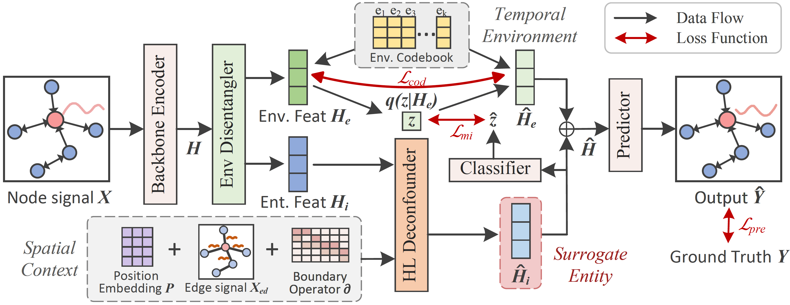

# Deciphering Spatio-Temporal Graph Forecasting: A Causal Lens and Treatment

This repo provides the implementation code corresponding to our NeurIPS-23 paper entitled [Deciphering Spatio-Temporal Graph Forecasting: A Causal Lens and Treatment](https://arxiv.org/pdf/2309.13378.pdf). The code is implemented on Pytorch 1.10.2 on a server with NVIDIA RTX A6000.



## Description
We present CaST, a new framework that takes a causal look into Spatio-Temporal Graph (STG) forecasting, tackling temporal out-of-distribution issues and dynamic spatial causation. We employ two causal tools: Back-door adjustment, implemented through a disentanglement block to distinguish invariant parts from temporal environments, and Front-door adjustment, which introduces a surrogate variable to emulate node information filtered based on their causal relationships.


## Requirements

CaST uses the following dependencies:

- Pytorch 1.10.2 and its dependencies
- Numpy and Scipy
- CUDA 11.3 or latest version, cuDNN

## Dataset

### Overview
The performance of CaST was validated using three datasets: PEMS08, AIR-BJ, and AIR-GZ. AIR-BJ and AIR-GZ contain one-year PM$_{2.5}$ readings obtained from air quality monitoring stations located in Beijing and Guangzhou, respectively. [PEMS08](https://github.com/Davidham3/ASTGCN/tree/master/data/PEMS08) contains traffic flow data that was collected by sensors deployed on the road network. Traffic flow data is often considered to be a complex and challenging type of spatio-temporal data due to the numerous factors that can impact it, such as weather, time of day, and road conditions. 

For proper execution, please ensure that the datasets are placed within the `.\data\[dataset_name]\dataset.npy`. Ensure that the datasets adhere to the following structure: `(num_samples, num_nodes, input_dim)`.

### Edge Features
For detailed information on how we create edge attributes, please refer to Appendix D of our paper, where we provide an extensive discussion and introduction on it. Additionally, you may customize the edge attribute creation by implementing your own method, as an alternative to the Pearson correlation or the Time-delayed Dynamic Time Warping (DTW) method used in our study.

If you prefer to follow our approach, here is an example code to generate the `peacor_adj.npy` file:
```
def get_peacor_adj(data_path, threshold, save=False):
    # Load the dataset
    data = np.load(data_path + 'train.npz')['data']
    print("Data shape:", data.shape)
    
    # Compute the Pearson correlation coefficient matrix
    peacor = torch.corrcoef(torch.Tensor(data[...,0]).permute(1, 0))
    
    # Apply threshold
    peacor[peacor < threshold] = 0
    peacor[torch.eye(peacor.shape[0], dtype=bool)] = 0

    # Normalize the coefficients
    nonzero_peacor = peacor[peacor != 0]
    p_min, p_max = nonzero_peacor.min(), nonzero_peacor.max()
    peacor[peacor != 0] = (nonzero_peacor - p_min) / (p_max - p_min)

    # Visualization
    plt.figure(dpi=100)
    sns.heatmap(peacor)
    plt.show()
    
    # Save the result
    if save:
        np.save(data_path + 'peacor_adj.npy', peacor)
```
For reproducibility, we also provide `peacor_adj.npy`, `sparse_adj.npy`, and `dist_adj.npy` in the `.\data\PEMS08\` directory for reference.

## Arguments

We introduce some major arguments of our main function here.

Training settings:

- mode: indicating the mode, e.g., train or test
- gpu: using which GPU to train our model
- seed: the random seed for experiments
- dataset: which dataset to run
- base_lr: the learning rate at the beginning
- lr_decay_ratio: the ratio of learning rate decay
- batch_size: training or testing batch size
- seq_len: the length of historical steps
- horizon: the length of future steps
- input_dim: the dimension of inputs
- output_dim: the dimension of inputs
- max_epochs: the maximum of training epochs
- patience: the patience of early stopping
- save_preds: whether to save prediction results
- train_ratio: the training ratio
- val_ratio: the evaluastion ratio

Model hyperparameters:

- hid_dim: the hidden dimensions in CaST
- dropout: dropout rate
- n_envs: the number of environments
- node_embed_dim: the dimensionality of node embeddings
- K: the depth of HL Deconfounder block

## Training and Evaluation

The following examples are conducted on the datasets:

```
# PEMS08
python ./experiments/cast/main.py --dataset PEMS08 --mode 'train' --hid_dim 64 --n_envs 20 --node_embed_dim 5 --K 2
```
```
# AIR-BJ
python ./experiments/cast/main.py --dataset AIR_BJ --mode 'train' --hid_dim 64 --n_envs 10 --node_embed_dim 10 --K 3
```
```
# AIR-GZ
python ./experiments/cast/main.py --dataset AIR_GZ --mode 'train' --hid_dim 64 --n_envs 20 --node_embed_dim 5 --K 2
```

## Code Reference

HL-HGAT: https://github.com/JH-415/HL-HGAT

VQVAE: https://github.com/ritheshkumar95/pytorch-vqvae


## Citation

If you find our work useful in your research, please cite:

```
@article{xia2023deciphering,
  title={Deciphering Spatio-Temporal Graph Forecasting: A Causal Lens and Treatment},
  author={Xia, Yutong and Liang, Yuxuan and Wen, Haomin and Liu, Xu and Wang, Kun and Zhou, Zhengyang and Zimmermann, Roger},
  journal={arXiv preprint arXiv:2309.13378},
  year={2023}
}
```
